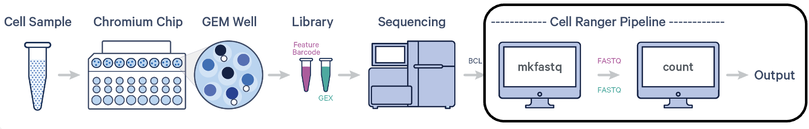
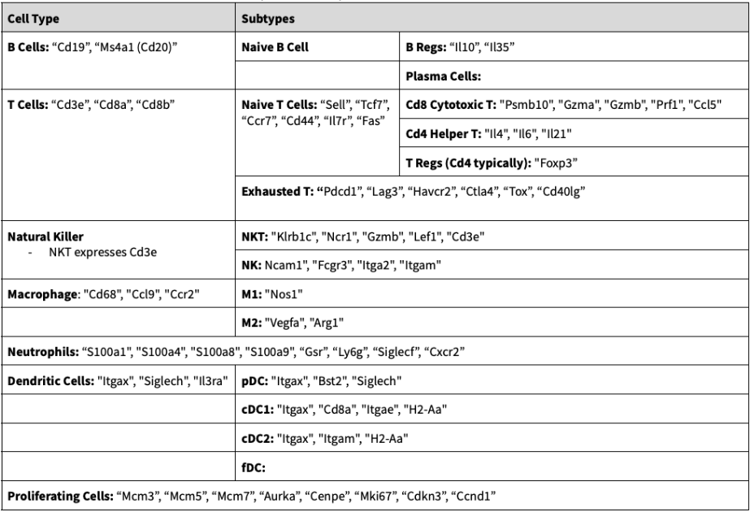
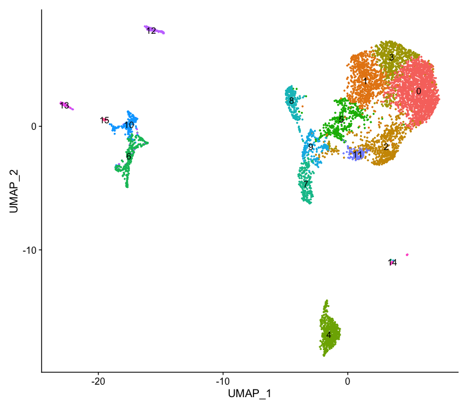
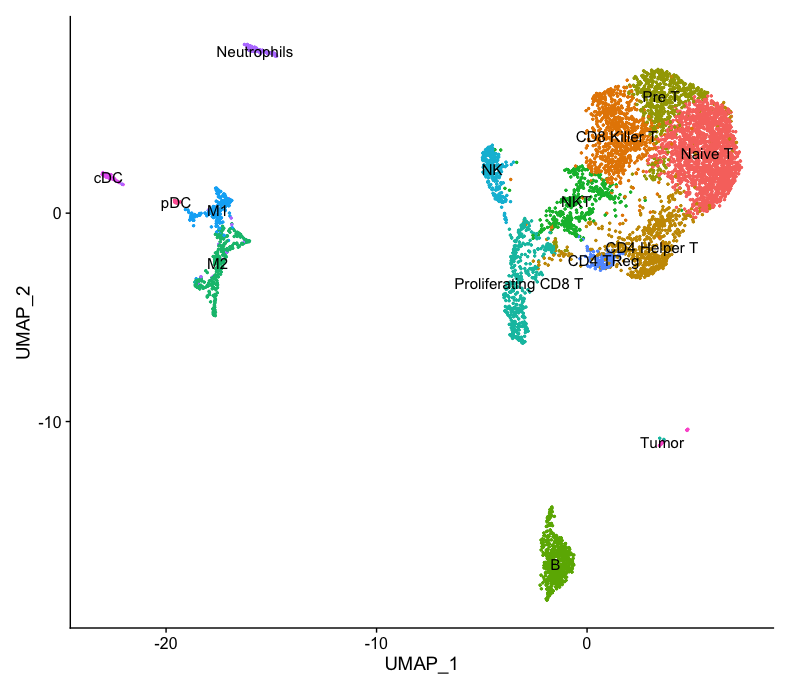
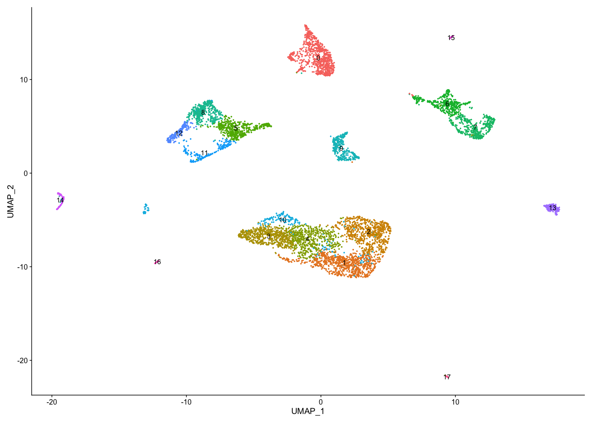
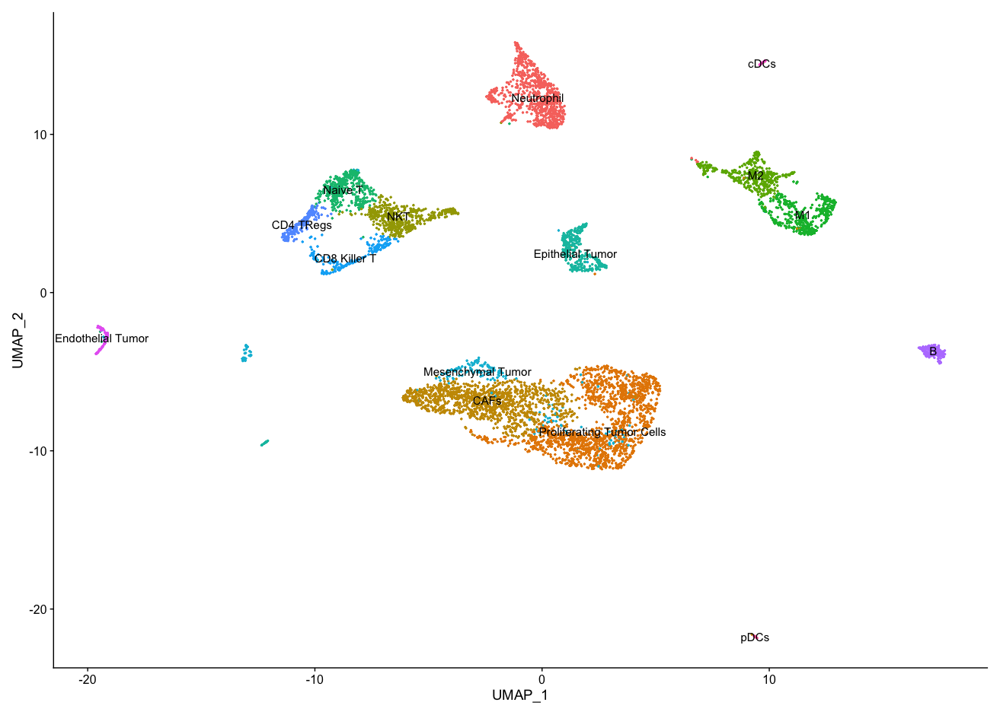

# Immunophenotyping scRNA-seq data using Seurat 
RNA samples of CD40-treated & non-treated Triple-Negative Breast Cancer (TNBC) _mus musculus_ models were processed using 10x Genomics Cell Ranger Pipeline to produce scRNA-seq data

## Seurat Preprocessing
Seurat is a R package used for scRNA-seq data processing, cell clustering, and immunophenotyping.
- **Input**: 10X Genomics directory (barcodes, features, matrix files)
- **Output**: Seurat object that can be used for downstream analysis 

**Steps:**
1. Create Seurat Object using 10X Genomics data via `Read10X()` amd `CreateSeuratObject()`

2. Quality Control using `PercentageFeatureSet()`
- Find percentage of reads that map to mitochondrial/ribosomal genome and remove them since dying cells typically have high mitochondrial activity
- Similarly we would also filter lowly expressed genes like we did for DESeq2

3. Normalization of data using `LogNormalize()`
- Log transform the data into a log2 scale which is important for data with high variance, such as scRNA-seq data

4. Feature Selection using `FindVariableFeatures()`
- Identify genes highly expressed in some cells and lowly expressed in others

5. Scaling the data using `ScaleData()`
- Peforms a linear transformation that shifts mean expression of each gene across cells to 0 and variance to 1
- This step is needed prior to performing PCA and removes background noise in the data so cells do not cluster based on noise

6. Linear Dimensionality Reduction (PCA) using `RunPCA()`: 
- To identify true dimensionality of data 
- Visualize PCs using `ElbowPlot()` to see how many PCs we should use for clustering

7. Clustering using `FindNeighbors()` and `FindClusters()`: 
- Seurat uses Shared Nearest Neighbor (SNN) clustering algorithm to group the cells with similar gene expression distance cells with dissimilar gene expression

8 Non-linear Dimensionality Reduction (UMAP or tSNE) via `RunUMP()`: 
- Required to view clusters in low dimensional space 

9. Identify differentially expressed genes (DEGs): 
- Use `FindAllMarkers()` to find DEGs in each cluster compared to all other clusters
- Use biological markers that define each cluster to classify the clusters using `ViolinPlot()` or `FeaturePlot()` 

# Cell Marker List for Immunophenotyping:
**NOTE:** All immune cells express Cd45 / Ptprc

*Table 1. Immune Cell Markers*

*Table 2. Non-immune Cell Markers*

## External Tools for Immunophenotyping:
- [MSigDB](https://www.gsea-msigdb.org/gsea/msigdb/human/annotate.jsp) and/or [Immgen's MyGeneSet](http://rstats.immgen.org/MyGeneSet_New/index.html) can be used to find gene sets most correlated to a given list of genes
- [inferCNV](https://github.com/broadinstitute/infercnv) can be used to identify and confirm tumor clusters

## CD40-treated TNBC _mus musculus_
A resolution of 0.7 was used when using `FindClusters()`

  

## Non-treated TNBC _mus musculus_
A resolution of 0.7 was used when using `FindClusters()`

  

